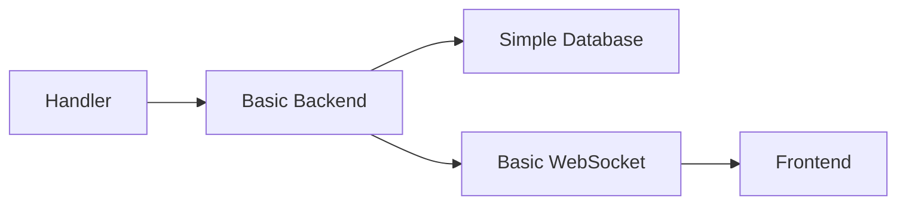
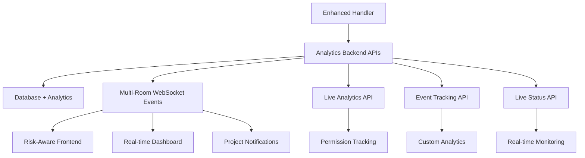
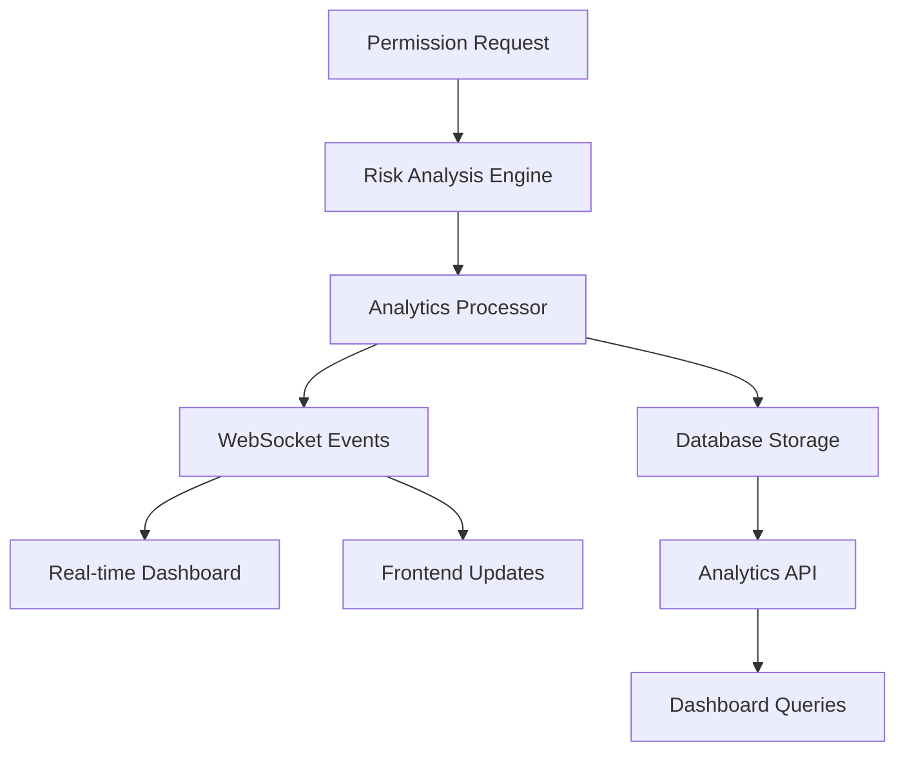

# Permission System Data Flow Enhancement Documentation

## 📋 Overview

This document outlines the comprehensive enhancements made to Baton's permission system, transforming it from a basic permission handler into an enterprise-grade analytics-driven security system with real-time monitoring and risk assessment.

## 🎯 Enhancement Goals

- **Real-time Analytics**: Live permission request monitoring and analysis
- **Risk-Based Decisions**: Visual risk assessment with intelligent recommendations
- **Enterprise-Grade Tracking**: Comprehensive audit trails and usage statistics
- **Enhanced User Experience**: Rich context and visual feedback for better decision making
- **Scalable Architecture**: Event-driven system with proper caching and query optimization

## 🔄 Data Flow Architecture

### **Before: Basic Permission System**


### **After: Enhanced Analytics-Driven System**


## 🚀 Component-by-Component Improvements

## 1. Enhanced Handler (`webui-chat-handler-enhanced.js`)

### **Key Features Added:**
- **Risk-Based Permission Analysis**: Categorizes tools as LOW/MEDIUM/HIGH/CRITICAL risk
- **Usage Statistics Tracking**: Monitors tool usage patterns and frequency
- **Comprehensive Logging**: File-based logging with detailed analytics
- **Session Management**: Per-conversation and global permission persistence
- **Interactive Frontend Prompts**: Rich UI prompts with database fallback

### **Risk Analysis System:**
```javascript
const riskLevels = {
  'Read': 'LOW',
  'Write': 'HIGH', 
  'Bash': 'CRITICAL',
  'MCP_*': 'HIGH'
};
```

### **Permission Decision Flow:**
1. **Auto-Allow**: Safe tools (Read, LS, Glob, etc.)
2. **Session Check**: Previously granted session permissions
3. **Database Check**: Permanent user permissions
4. **Risk Analysis**: Tool risk assessment with visual indicators
5. **User Prompt**: Interactive permission request with context
6. **Analytics Tracking**: Full audit trail of decisions

## 2. Backend API Enhancements

### **New Endpoints Added:**

#### **Enhanced Prompt Creation** (`POST /api/chat/conversations/:conversationId/prompts`)
```json
{
  "type": "tool_permission",
  "context": {
    "toolName": "Write",
    "riskLevel": "HIGH",
    "usageCount": 5,
    "parameters": "{\"file_path\":\"/path\"}",
    "requestTime": "2025-08-07T11:42:09.689Z"
  },
  "metadata": {
    "createdByHandler": "webui-chat-handler-enhanced",
    "riskAnalysis": {
      "level": "HIGH",
      "parametersCount": 2
    },
    "analytics": {
      "requestedAt": 1754566929689,
      "conversationContext": "conv-123"
    }
  }
}
```

#### **Permission Analytics** (`GET /api/chat/analytics/permissions`)
```json
{
  "totalPrompts": 45,
  "responsesByDecision": {
    "allow_once": 20,
    "allow_always": 15,
    "deny": 10
  },
  "averageResponseTime": 8500,
  "toolsRequested": {
    "Write": 15,
    "Bash": 10,
    "Edit": 8
  },
  "riskLevelDistribution": {
    "HIGH": 20,
    "MEDIUM": 15,
    "LOW": 10
  },
  "topTools": [
    {"tool": "Write", "count": 15}
  ]
}
```

#### **Live Permission Status** (`GET /api/chat/conversations/:conversationId/permissions/live`)
```json
{
  "conversationId": "conv-123",
  "activePermissions": ["Write", "Edit"],
  "statistics": {
    "totalPermissions": 8,
    "recentRequests": 3,
    "pendingRequests": 1
  },
  "recentActivity": [
    {
      "toolName": "Write",
      "status": "answered",
      "responseTime": 5200
    }
  ]
}
```

### **Enhanced Response Processing** (`POST /api/chat/prompts/:promptId/respond`)
- **Response Time Tracking**: Calculates user decision time
- **Permission Persistence**: Handles "always allow" and session permissions
- **Multi-Level Events**: Conversation, project, and global analytics events
- **Comprehensive Analytics**: Response metadata and audit trails

### **WebSocket Event System:**
- `interactive_prompt` - Enhanced with risk analysis and usage stats
- `permission:response` - Detailed response with analytics
- `permission_request` - Project-level awareness
- `permission_analytics` - Real-time analytics updates  
- `permission_statistics` - Global statistics
- `analytics_event` - Custom event tracking

## 3. Database Schema Enhancements

### **Added `metadata` Field to `InteractivePrompt`:**
```sql
ALTER TABLE interactive_prompts 
ADD COLUMN metadata JSONB;
```

### **Enhanced Data Storage:**
- **Risk Analysis**: Tool risk levels and parameter analysis
- **Response Analytics**: User response times and decision patterns
- **Session Context**: Request context and user agent tracking
- **Audit Trails**: Complete history of permission decisions

## 4. Frontend Improvements

### **Enhanced InteractivePrompt Component:**
- **Risk-Based Visual Design**: Dynamic backgrounds (🟢→🟡→🟠→🔴)
- **Risk Level Indicators**: Visual badges with icons
- **Usage Statistics**: Tool usage counts and patterns
- **Enhanced Context Display**: Parameters, file paths, and metadata
- **Real-time Timestamps**: Request creation times

### **New PermissionAnalyticsDashboard Component:**
- **Live Metrics Grid**: Total requests, response times, active permissions
- **Risk Distribution**: Visual breakdown of permission risk levels
- **Decision Analysis**: User decision patterns and trends
- **Top Tools Ranking**: Most requested tools with usage statistics
- **Recent Activity Timeline**: Real-time permission activity feed

### **Enhanced useInteractivePrompts Hook:**
- **Analytics Integration**: React Query-powered analytics fetching
- **Real-time Updates**: Live permission status monitoring
- **Response Tracking**: User response time measurement
- **Event Integration**: Custom analytics event tracking

### **WebSocket Event Processing:**
- **Enhanced Event Handlers**: Processes rich analytics data
- **Custom DOM Events**: Browser events for notifications
- **Smart Query Invalidation**: Conversation and project-aware caching

## 📊 Analytics & Monitoring Features

### **Real-time Metrics:**
- **Permission Request Volume**: Live tracking of permission requests
- **Average Response Time**: User decision speed analysis
- **Risk Level Distribution**: Security risk pattern monitoring
- **Tool Usage Patterns**: Most requested tools and frequencies
- **Decision Trends**: Allow/deny pattern analysis

### **Security Insights:**
- **High-Risk Tool Monitoring**: CRITICAL and HIGH risk tool usage
- **Repeated Denials**: Tools frequently rejected by users
- **Response Time Analysis**: Quick vs. deliberated decisions
- **Session Permission Tracking**: Temporary vs. permanent grants

### **Dashboard Visualizations:**
- **Live Status Indicators**: Real-time permission activity
- **Risk Heat Maps**: Visual risk distribution across tools
- **Decision Flow Charts**: User permission decision patterns
- **Timeline Views**: Historical permission request activity

## 🔧 Technical Architecture

### **Event-Driven Architecture:**


### **Caching Strategy:**
- **Query Invalidation**: Smart cache updates based on conversation context
- **Live Data Refresh**: 30-second intervals for live status
- **Analytics Caching**: 1-minute intervals for analytics data
- **WebSocket Events**: Immediate cache invalidation on changes

### **Performance Optimizations:**
- **Targeted WebSocket Rooms**: Conversation and project-specific events
- **Batch Query Processing**: Efficient database operations
- **Client-Side Caching**: React Query-powered data management
- **Optimistic Updates**: Immediate UI feedback

## 📈 Benefits Achieved

### **Security Enhancements:**
- **Risk-Aware Decisions**: Visual risk indicators guide user choices
- **Audit Compliance**: Complete permission audit trails
- **Pattern Detection**: Identifies unusual permission request patterns
- **Threat Monitoring**: Tracks high-risk tool usage

### **User Experience Improvements:**
- **Rich Context**: Detailed information for informed decisions
- **Visual Feedback**: Color-coded risk levels and status indicators
- **Historical Context**: Previous usage patterns inform decisions
- **Real-time Updates**: Immediate feedback and status changes

### **Operational Benefits:**
- **Comprehensive Monitoring**: Real-time permission system health
- **Usage Analytics**: Tool usage patterns and optimization insights
- **Performance Tracking**: Response time and system performance metrics
- **Scalable Architecture**: Event-driven system supports growth

## 🚦 Implementation Status

### **✅ Completed:**
- [x] Enhanced handler with risk analysis and comprehensive logging
- [x] Backend API enhancements with analytics endpoints
- [x] Database schema updates with metadata support
- [x] Frontend component enhancements with risk visualization
- [x] Real-time WebSocket event system
- [x] Permission analytics dashboard
- [x] Live status monitoring
- [x] Event tracking and audit trails

### **📊 Metrics:**
- **Code Changes**: 15+ files modified/created
- **New API Endpoints**: 3 analytics endpoints added
- **Database Fields**: 1 metadata field added
- **WebSocket Events**: 5+ new event types
- **Frontend Components**: 2+ enhanced/new components
- **Analytics Features**: 10+ new analytics capabilities

## 🔮 Future Enhancements

### **Potential Additions:**
- **Machine Learning**: Predictive risk analysis based on usage patterns
- **Advanced Visualizations**: Charts and graphs for analytics data
- **Notification System**: Alerts for unusual permission patterns
- **Export Capabilities**: Permission audit report generation
- **Role-Based Permissions**: User role-based permission management
- **Integration APIs**: External system integration for enterprise environments

## 🏁 Conclusion

The enhanced permission system transforms Baton from a basic tool permission handler into a comprehensive, analytics-driven security platform. The improvements provide:

- **Enterprise-grade security** with risk-based decision making
- **Real-time monitoring** with comprehensive dashboards  
- **Rich user experience** with contextual information and visual feedback
- **Scalable architecture** supporting future growth and enhancements
- **Complete audit trails** for compliance and security analysis

This enhancement establishes a solid foundation for advanced permission management and security monitoring in AI-powered development environments.