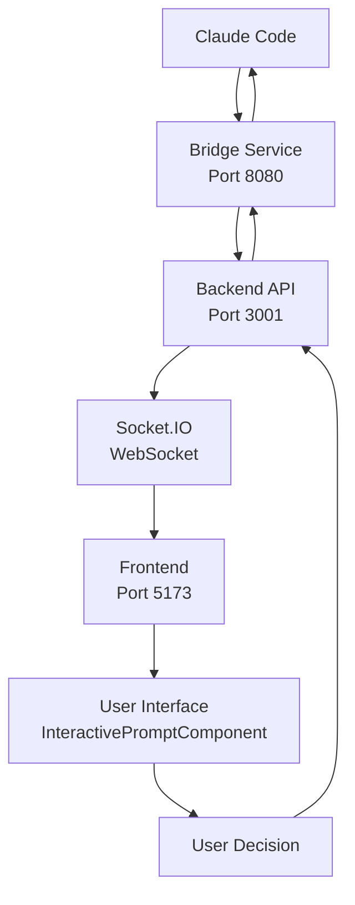

# Interactive Permission System Flow Documentation

This document provides a comprehensive overview of the Claude Code Bridge permission system, covering the complete flow from tool request to user interaction and response.

## System Architecture Overview



## Complete Permission Flow

### Phase 1: Tool Request Detection

#### 1.1 Claude Code Execution
```
🚀 Bridge executing Claude Code request req_me1r2k2l_jz210xymz
📝 Message: "write me a joke in gpt5.md..."
🔗 Session: new
🛠️  Tools: Read, LS, Glob, Grep, WebFetch, WebSearch
```

**Location**: `scripts/bridge.ts`
- Bridge receives request from Claude Code WebUI
- Parses message and available tools
- Configures session parameters

#### 1.2 High-Risk Tool Detection
```
🛡️  High-risk tool detected: Write - trying backend permission
🔐 Requesting permission for Write from backend
```

**Location**: `scripts/bridge.ts` - `requestPermissionFromBackend()`
- Bridge analyzes Claude Code's tool usage
- Identifies high-risk tools (Write, Edit, MultiEdit, Bash)
- Triggers permission request flow

### Phase 2: Permission Request Creation

#### 2.1 Conversation Context Setup
```
🗨️  Ensuring conversation cme1r2k1w000214dtrmr4ymw5 exists
✅ Conversation cme1r2k1w000214dtrmr4ymw5 already exists
```

**Location**: `scripts/bridge.ts` - `ensureConversationExists()`
- Bridge ensures conversation exists in backend database
- Creates conversation if needed
- Links to project context

#### 2.2 Backend Permission Request
```javascript
// Bridge sends HTTP request to backend
POST /api/chat/conversations/{conversationId}/prompts
{
  "type": "tool_permission",
  "title": "Write Tool Permission", 
  "message": "Allow Claude Code to use the Write tool?",
  "options": [
    {"id": "allow_once", "label": "Allow once", "value": "yes"},
    {"id": "allow_always", "label": "Allow always", "value": "yes_dont_ask"}, 
    {"id": "deny", "label": "Deny", "value": "no"}
  ],
  "context": {
    "toolName": "Write",
    "riskLevel": "HIGH",
    "parameters": "filename: gpt5.md"
  }
}
```

**Location**: `backend/src/routes/chat.ts` - POST `/conversations/:conversationId/prompts`

### Phase 3: Multi-Channel Prompt Delivery

#### 3.1 Robust Prompt Creation
```
🔧 Creating robust prompt delivery for: tool_permission_rmr4ymw5_1754592513342_f5hj (tool_permission) Risk: HIGH
📝 Attempting to create prompt tool_permission_rmr4ymw5_1754592513342_f5hj (attempt 1/3)
✅ Successfully created prompt tool_permission_rmr4ymw5_1754592513342_f5hj on attempt 1
```

**Location**: `backend/src/utils/promptDelivery.ts` - `PromptDeliveryService`

- **Database Storage**: Creates `interactive_prompt` record with metadata
- **Retry Logic**: 3 attempts with exponential backoff
- **Health Checks**: Validates database connectivity

#### 3.2 WebSocket Delivery (Primary Channel)
```
📡 Delivering prompt tool_permission_rmr4ymw5_1754592513342_f5hj via WebSocket to conversation-cme1r2k1w000214dtrmr4ymw5
📤 WebSocket events emitted for prompt tool_permission_rmr4ymw5_1754592513342_f5hj
✅ Prompt tool_permission_rmr4ymw5_1754592513342_f5hj delivered via: websocket in 37ms
```

**Location**: `backend/src/utils/promptDelivery.ts` - `deliverViaWebSocket()`

**Events Emitted**:
```javascript
// Primary event to conversation room
socket.to(`conversation-${conversationId}`).emit('interactive_prompt', {
  promptId: 'tool_permission_rmr4ymw5_1754592513342_f5hj',
  conversationId: 'cme1r2k1w000214dtrmr4ymw5',
  type: 'tool_permission',
  title: 'Write Tool Permission',
  message: 'Allow Claude Code to use the Write tool?',
  options: [...],
  context: { toolName: 'Write', riskLevel: 'HIGH', ... },
  timestamp: 1754592513342,
  requiresAck: true,
  deliveryId: 'tool_permission_rmr4ymw5_1754592513342_f5hj-1754592513342'
});

// Project-level awareness event  
socket.to(`project-${projectId}`).emit('permission_request', {
  conversationId: 'cme1r2k1w000214dtrmr4ymw5',
  promptId: 'tool_permission_rmr4ymw5_1754592513342_f5hj',
  toolName: 'Write',
  riskLevel: 'HIGH',
  timestamp: 1754592513342
});
```

#### 3.3 Fallback Channels (If WebSocket Fails)
1. **Server-Sent Events (SSE)**: HTTP streaming for real-time updates
2. **HTTP Polling**: Bridge polls GET `/prompts/{promptId}` every 500ms  
3. **Database Storage**: Persistent fallback with localStorage recovery

### Phase 4: Frontend Reception & Display

#### 4.1 WebSocket Event Handling
**Location**: `frontend/src/hooks/useWebSocket.ts` - `setupEventListeners()`

```javascript
socket.on('interactive_prompt', (data) => {
  console.log('🔔 Received enhanced interactive prompt:', data);
  
  // Only handle prompts for current conversation
  if (data.conversationId !== conversationId) return;
  
  // Create enhanced prompt object with analytics
  const prompt = {
    id: data.promptId,
    conversationId: data.conversationId,
    type: data.type,
    title: data.title, 
    message: data.message,
    options: data.options,
    context: {
      ...data.context,
      riskLevel: data.riskLevel,
      toolName: data.toolName,
      usageCount: data.context?.usageCount || 0
    },
    status: 'pending',
    timeoutAt: new Date(Date.now() + 30000).toISOString(),
    // Enhanced analytics data
    usageStatistics: data.usageStatistics,
    riskLevel: data.riskLevel,
    analytics: { ... }
  };
  
  // Add to pending prompts
  setPendingPrompts(prev => [...prev.filter(p => p.id !== prompt.id), prompt]);
});
```

#### 4.2 Acknowledgment Protocol  
**Location**: `frontend/src/hooks/useInteractivePrompts.ts`

```javascript
// Send acknowledgment if required
if (data.requiresAck && socket) {
  const acknowledgment = {
    promptId: data.promptId,
    deliveryId: data.deliveryId,
    conversationId: data.conversationId,
    timestamp: Date.now(),
    clientInfo: {
      userAgent: navigator.userAgent,
      screenResolution: `${window.screen.width}x${window.screen.height}`,
      windowSize: `${window.innerWidth}x${window.innerHeight}`,
      online: navigator.onLine,
      language: navigator.language
    }
  };
  
  console.log('📨 Sending prompt acknowledgment:', acknowledgment);
  socket.emit('prompt_received_confirmation', acknowledgment);
  
  // HTTP backup acknowledgment
  sendPromptAcknowledgmentHTTP(data.promptId, acknowledgment.clientInfo);
}
```

#### 4.3 Professional UI Rendering
**Location**: `frontend/src/components/chat/ChatPage.tsx` & `InteractivePrompt.tsx`

```javascript
// ChatPage renders prompts using professional component
{pendingPrompts.map(prompt => (
  <InteractivePromptComponent
    key={prompt.id}
    prompt={prompt}
    onOptionSelect={handlePromptResponse}
    isResponding={isRespondingToPrompt}
  />
))}
```

**InteractivePromptComponent Features**:
- 🎨 **Professional Dark Theme** with risk-based color coding
- 🚨 **Risk Level Indicators**: LOW/MEDIUM/HIGH/CRITICAL with icons
- 📊 **Usage Statistics**: Shows previous tool usage count
- 🛠️ **Enhanced Context**: Tool parameters, file paths, project location  
- ⏱️ **Timeout Warnings**: 30-second countdown with visual feedback
- 🏷️ **Semantic Test IDs**: For automation and testing

### Phase 5: User Interaction

#### 5.1 Permission Options
Users see three standard options:
1. **"Allow once"** (`allow_once`) - Temporary permission for this request
2. **"Allow always"** (`allow_always`) - Permanent permission (stored in database)  
3. **"Deny"** (`deny`) - Reject the tool usage request

#### 5.2 User Decision Capture
```javascript
const handlePromptResponse = useCallback(async (promptId: string, optionId: string) => {
  const startTime = Date.now();
  
  // Immediately remove from pending prompts (optimistic update)
  setPendingPrompts(prev => prev.filter(p => p.id !== promptId));
  
  // Send response to backend
  await respondToPrompt.mutateAsync({ promptId, optionId, startTime });
});
```

### Phase 6: Response Processing

#### 6.1 Backend Response Handling
**Location**: `backend/src/routes/chat.ts` - POST `/prompts/:promptId/respond`

```javascript
// Update prompt status in database
const prompt = await prisma.interactivePrompt.update({
  where: { id: promptId },
  data: {
    status: 'answered',
    selectedOption,
    respondedAt: new Date(responseTime),
    autoHandler: 'user_selection',
    metadata: {
      responseTime: responseTimeMs,
      userAgent: req.headers['user-agent'],
      timestamp: responseTime,
      analytics: { ... }
    }
  }
});

// Enhanced response with full context
const enhancedResponse = {
  id: selectedOption,
  label: selectedOptionData?.label,
  value: selectedOptionData?.value, 
  isRecommended: selectedOptionData?.isRecommended || false,
  metadata: {
    selectedAt: responseTime,
    responseTime: responseTimeMs,
    userDecision: selectedOptionData?.value,
    toolName: originalPrompt.context?.toolName,
    riskLevel: originalPrompt.context?.riskLevel
  }
};
```

#### 6.2 Multi-Channel Notifications
```javascript
// Emit to conversation room
ioInstance?.to(`conversation-${originalPrompt.conversationId}`)
  .emit('permission:response', {
    promptId,
    response: enhancedResponse,
    timestamp: responseTime,
    analytics: { responseTime: responseTimeMs, ... }
  });

// Project-level analytics
ioInstance?.to(`project-${originalPrompt.conversation.projectId}`)
  .emit('permission_analytics', {
    conversationId: originalPrompt.conversationId,
    toolName: originalPrompt.context?.toolName,
    decision: selectedOptionData?.value,
    responseTime: responseTimeMs,
    riskLevel: originalPrompt.context?.riskLevel
  });

// Global analytics dashboard
ioInstance?.emit('permission_statistics', {
  totalResponses: await prisma.interactivePrompt.count({ where: { status: 'answered' }}),
  averageResponseTime: responseTimeMs,
  decision: selectedOptionData?.value,
  riskLevel: originalPrompt.context?.riskLevel
});
```

### Phase 7: Bridge Response & Claude Code Continuation

#### 7.1 Bridge Polling Resolution
```
⏳ Waiting for user response to prompt tool_permission_rmr4ymw5_1754592513342_f5hj (timeout: 120000ms)
✅ Received response for prompt tool_permission_rmr4ymw5_1754592513342_f5hj: allow_once
✅ User granted permission for Write
✅ Tool Write approved by user/fallback
```

**Location**: `scripts/bridge.ts` - `waitForPermissionResponseProgressive()`

**Bridge polls** GET `/prompts/{promptId}` every 500ms until:
- ✅ **User responds** - Gets response and continues
- ⏰ **30s timeout** - First escalation notification  
- ⏰ **60s timeout** - Extended wait with urgency
- ⏰ **120s timeout** - Final fallback to auto-allow/deny

#### 7.2 Claude Code Tool Execution
```
📨 Message 3 type: user for req_me1r2k2l_jz210xymz
✅ Claude Code execution completed for req_me1r2k2l_jz210xymz: success
🏁 Bridge execution completed for req_me1r2k2l_jz210xymz (6 messages)
```

**Bridge enables tool** and Claude Code continues execution:
- **`allow_once`** → Tool approved for this request only
- **`allow_always`** → Tool approved + permission stored for future use
- **`deny`** → Tool blocked, Claude Code receives "Permission denied"

## Progressive Timeout Strategy

### Timeout Stages
1. **0-30s**: Normal waiting period with WebSocket delivery
2. **30-60s**: First escalation - sends urgency notification to frontend  
3. **60-120s**: Extended wait with persistent notifications
4. **120s+**: Fallback behavior based on risk level
   - **LOW risk**: Auto-allow
   - **MEDIUM/HIGH risk**: Auto-deny  
   - **CRITICAL risk**: Auto-deny + audit log

### Escalation Events
```javascript
// Stage 1: 30s escalation
ioInstance?.to(`conversation-${conversationId}`).emit('permission_escalation', {
  promptId,
  stage: 1,
  escalationType: 'timeout_warning',
  message: 'TIMEOUT WARNING: Permission still needed for Write',
  urgencyLevel: 1
});

// Stage 2: 60s escalation  
ioInstance?.to(`project-${projectId}`).emit('permission_escalation_project', {
  promptId,
  stage: 2,
  escalationType: 'urgent_timeout', 
  message: 'URGENT TIMEOUT: Permission still needed for Write',
  urgencyLevel: 2
});

// Stage 3: 120s global escalation
ioInstance?.emit('permission_escalation_global', {
  promptId,
  stage: 3,
  escalationType: 'critical_timeout',
  message: 'CRITICAL TIMEOUT: Permission still needed for Write',
  urgencyLevel: 3
});
```

## Permission Storage & Persistence

### Database Schema
```sql
-- Interactive prompts table
CREATE TABLE interactive_prompt (
  id VARCHAR(255) PRIMARY KEY,
  conversationId VARCHAR(255) NOT NULL,
  sessionId VARCHAR(255),
  type VARCHAR(50) NOT NULL,
  title VARCHAR(255),
  message TEXT NOT NULL,
  options JSONB NOT NULL,
  context JSONB,
  metadata JSONB,
  status VARCHAR(20) DEFAULT 'pending',
  selectedOption VARCHAR(255),
  autoHandler VARCHAR(50),
  timeoutAt TIMESTAMP,
  createdAt TIMESTAMP DEFAULT NOW(),
  respondedAt TIMESTAMP
);

-- Conversation permissions for "allow always"
CREATE TABLE conversation_permission (
  id VARCHAR(255) PRIMARY KEY,
  conversationId VARCHAR(255) NOT NULL,
  toolName VARCHAR(255) NOT NULL,
  permission VARCHAR(20) NOT NULL, -- 'allow' | 'deny'
  createdAt TIMESTAMP DEFAULT NOW(),
  expiresAt TIMESTAMP
);
```

### Permission Persistence Logic
```javascript
// Check for existing permissions before creating prompt
const existingPermission = await prisma.conversationPermission.findFirst({
  where: {
    conversationId,
    toolName,
    permission: 'allow',
    OR: [
      { expiresAt: null }, // Permanent permission
      { expiresAt: { gte: new Date() } } // Not expired
    ]
  }
});

if (existingPermission) {
  // Skip prompt, auto-approve
  return { approved: true, reason: 'persistent_permission' };
}
```

## Analytics & Monitoring

### Real-Time Analytics Events
1. **Prompt Created**: Tool requested, risk level, context
2. **Prompt Delivered**: Delivery method, timing, acknowledgment  
3. **Prompt Responded**: User decision, response time, outcome
4. **Permission Granted/Denied**: Tool usage approval/denial
5. **Escalation Triggered**: Timeout warnings, urgency levels

### Analytics Dashboard Data
```javascript
{
  totalPrompts: 127,
  responsesByDecision: {
    "allow_once": 89,
    "allow_always": 23, 
    "deny": 15
  },
  averageResponseTime: 8450, // milliseconds
  toolsRequested: {
    "Write": 67,
    "Edit": 34,
    "Bash": 26
  },
  riskLevelDistribution: {
    "HIGH": 89,
    "MEDIUM": 23,
    "LOW": 15
  },
  topTools: [
    { tool: "Write", count: 67 },
    { tool: "Edit", count: 34 }, 
    { tool: "Bash", count: 26 }
  ]
}
```

## Error Handling & Recovery

### WebSocket Failure Recovery
1. **Primary**: WebSocket delivery fails → Log error
2. **Fallback 1**: Server-Sent Events (SSE) streaming  
3. **Fallback 2**: HTTP polling every 500ms
4. **Fallback 3**: Database persistence + frontend localStorage
5. **Emergency**: Manual prompt queue with notification alerts

### Bridge Connection Issues  
1. **Network errors**: Exponential backoff with 3 retries
2. **Backend unavailable**: Local prompt cache + offline mode
3. **Database issues**: File-based fallback storage  
4. **Critical errors**: Auto-deny with audit logging

### Frontend Failure Recovery
1. **WebSocket disconnect**: Auto-reconnect with exponential backoff
2. **Prompt display failure**: Emergency fallback UI 
3. **Response failure**: HTTP backup + retry logic
4. **Browser notifications**: Audio alerts for critical prompts

## Security Considerations

### Tool Risk Classification
- **LOW**: Read, LS, Glob, Grep - Information gathering tools
- **MEDIUM**: WebFetch, WebSearch - External data access
- **HIGH**: Write, Edit, MultiEdit - File modification
- **CRITICAL**: Bash - System command execution

### Permission Validation
- All permissions validated server-side
- No client-side permission bypassing  
- Audit logging for all permission decisions
- Automatic permission expiration
- Rate limiting for repeated requests

### Data Privacy
- No sensitive data in WebSocket events
- Tool parameters truncated for display
- Full context logged server-side only
- User decisions anonymized in analytics

---

This comprehensive flow ensures reliable, secure, and user-friendly permission management for Claude Code tool usage through the Baton integration system.